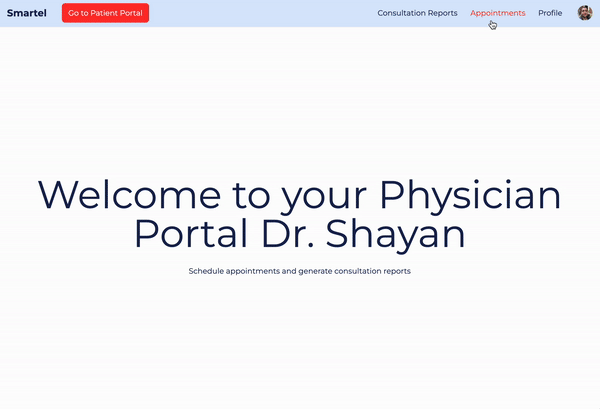
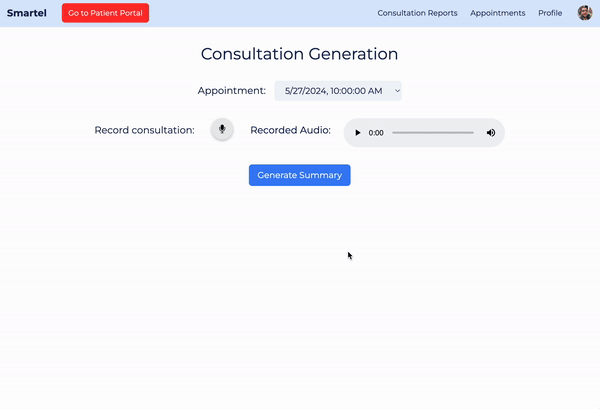
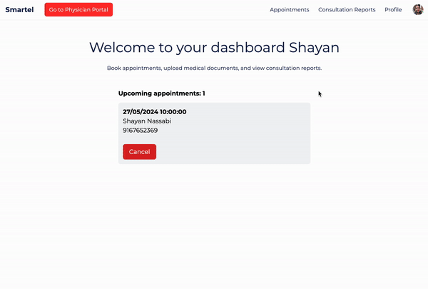
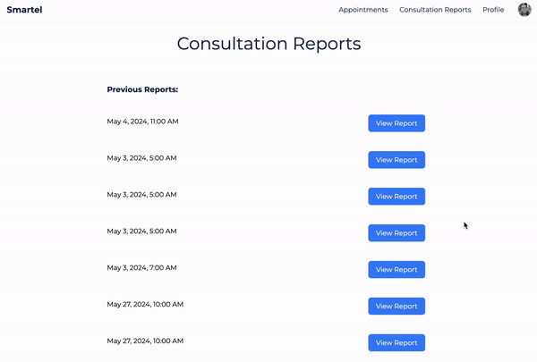

<div align="center">
  
</div>

# Smartel - Online Telehealth Portal

## Tech Stack

- React frontend
- FastAPI backend
- PostgreSQL backend database, hosted on AWS

## Features

- Schedule appointments as a physician
  <div align="center">
    
  </div>
- AI powered consultation summary generation
  <div align="center">
    
  </div>
- Book appointments as a patient
  <div align="center">
    
  </div>
- View summary documents from previous consultations.
  <div align="center">
    
  </div>

## Backend commands

To set up and manage the backend environment, follow these commands:

1. **Create a virtual environment:**

   ```bash
   python3 -m venv .venv
   ```

2. **Activate the virtual environment:**

   ```bash
   source .venv/bin/activate
   ```

3. **Install required packages from requirements.txt:**

   ```bash
   pip install -r requirements.txt
   ```

4. **Deactivate the virtual environment when you're done:**
   ```bash
   deactivate
   ```

## Running the servers
To run the backend server, use the following command:

1. **Go to the `backend` directory:**

    ```bash
    cd backend
    ```
1. **Run the backend server:**

    ```bash
    source .venv/bin/activate
    uvicorn app:app --reload
    ```
To run the front end server, use the following command:
1. **Install the required packages:**

    ```bash
    npm install

    # if vite is not installed
    npm install vite --save-dev
    ```

1. **Go to the `frontend/smartel/src` directory:**

    ```bash
    cd frontend/smartel/src
    ```

1. **Run the front end server:**

    ```bash
    npm run dev
    ```